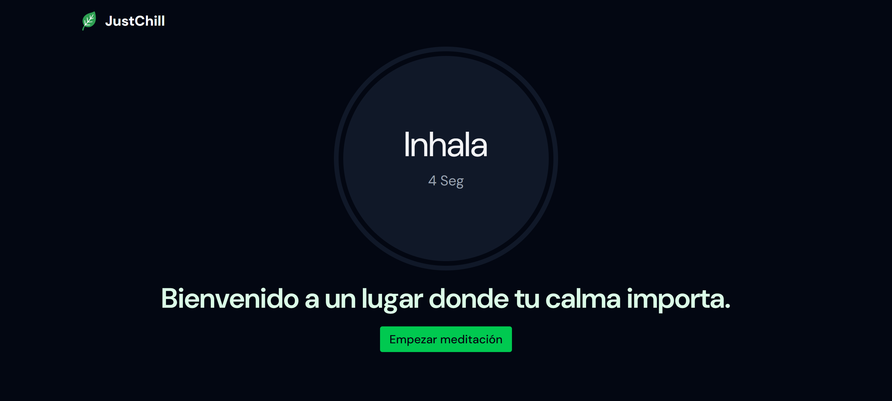

# JustChill 🧘

**Medita**, **Relájate** y disfruta de las experiencias que te entrega JustChill.

👉 Enlace: [https://justchillapp.netlify.app/](https://justchillapp.netlify.app/)

  
  
  
  
  
  
  
  

**v1.0.0**
